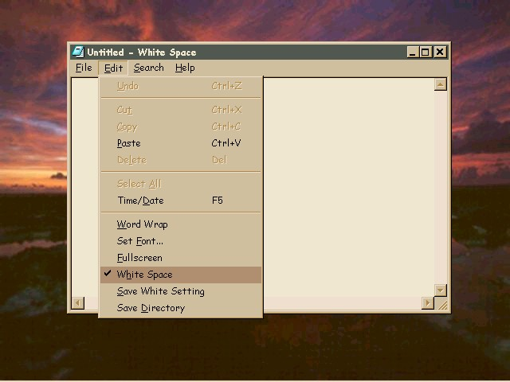



## WhiteSpace Editor

### Description

Appends invisible text to files using non-printing characters. This amounts to fairly good encryption only visible in a hex editor. Some subclassing is used so pushing the end button

from the VB IDE will crash it. Updated 12-17-2002.

Now uses RTF.
 
### More Info
 

             |
---                |---
**Submitted On**   |2003-02-04 10:12:06
**By**             |[D\.W\.](https://github.com/Planet-Source-Code/PSCIndex/blob/master/ByAuthor/d-w.md)
**Level**          |Intermediate
**User Rating**    |5.0 (10 globes from 2 users)
**Compatibility**  |VB 6\.0
**Category**       |[Files/ File Controls/ Input/ Output](https://github.com/Planet-Source-Code/PSCIndex/blob/master/ByCategory/files-file-controls-input-output__1-3.md)
**World**          |[Visual Basic](https://github.com/Planet-Source-Code/PSCIndex/blob/master/ByWorld/visual-basic.md)
**Archive File**   |[WhiteSpace153929242003\.zip](https://github.com/Planet-Source-Code/d-w-whitespace-editor__1-37797/archive/master.zip)

### API Declarations

Lots

